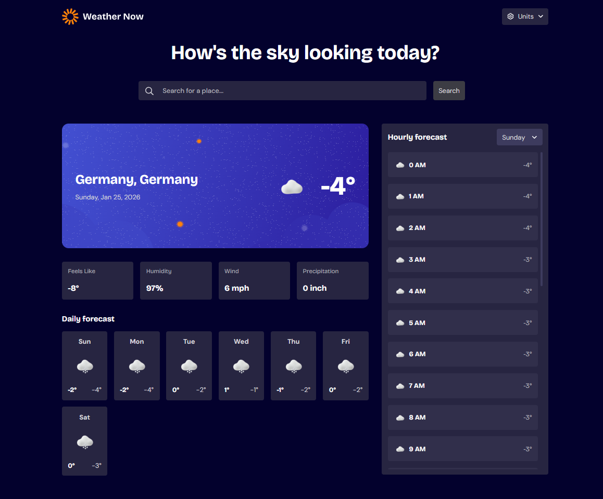

# Frontend Mentor - Weather app solution

This is a solution to the [Weather app challenge on Frontend Mentor](https://www.frontendmentor.io/challenges/weather-app-K1FhddVm49). Frontend Mentor challenges help you improve your coding skills by building realistic projects.

## Table of contents

- [Overview](#overview)
  - [The challenge](#the-challenge)
  - [Screenshot](#screenshot)
  - [Links](#links)
- [My process](#my-process)
  - [Built with](#built-with)
  - [What I learned](#what-i-learned)
  - [Continued development](#continued-development)
  - [Useful resources](#useful-resources)
- [Author](#author)

## Overview

### The challenge

Users should be able to:

- Search for weather information by entering a location in the search bar
- View current weather conditions including temperature, weather icon, and location details
- See additional weather metrics like "feels like" temperature, humidity percentage, wind speed, and precipitation amounts
- Browse a 7-day weather forecast with daily high/low temperatures and weather icons
- View an hourly forecast showing temperature changes throughout the day
- Switch between different days of the week using the day selector in the hourly forecast section
- Toggle between Imperial and Metric measurement units via the units dropdown
- Switch between specific temperature units (Celsius and Fahrenheit) and measurement units for wind speed (km/h and mph) and precipitation (millimeters) via the units dropdown
- View the optimal layout for the interface depending on their device's screen size
- See hover and focus states for all interactive elements on the page

### Screenshot

### Links

- [Solution](https://github.com/molinax18/fm-weather-app)
- [Live Site](https://molinax18.github.io/fm-weather-app/)

## My process

### Built with

- [React](https://reactjs.org/) - JS library
- [TypeScript](https://www.typescriptlang.org/) - For type safety
- [Vite](https://vitejs.dev/) - Build tool
- [TanStack Query](https://tanstack.com/query/latest) - For data fetching
- [Open-Meteo API](https://open-meteo.com/) - Weather data
- CSS Modules - For component styling
- [Day.js](https://day.js.org/) - Date manipulation
- [React Circle Flags](https://www.npmjs.com/package/react-circle-flags) - Country flags

### What I learned

During this project, I learned how to integrate external APIs like Open-Meteo for real-time weather data. I also improved my skills in using React Query for efficient data fetching and caching, and managing global state with React Context. Additionally, working with TypeScript helped ensure type safety across the application, and using CSS Modules for component-specific styling kept the styles organized and scoped.

### Continued development

In future projects, I want to focus on adding unit and integration tests to ensure code reliability. I'd also like to explore more advanced state management solutions like Zustand or Redux Toolkit, and improve accessibility features for better user experience.

### Useful resources

- [Open-Meteo API Documentation](https://open-meteo.com/en/docs) - For weather data integration
- [TanStack Query Documentation](https://tanstack.com/query/latest/docs/react/overview) - For data fetching best practices
- [React Circle Flags](https://www.npmjs.com/package/react-circle-flags) - For displaying country flags
- [Frontend Mentor](https://www.frontendmentor.io/) - For design challenges and community feedback

## Author

- Frontend Mentor - [@molinax18](https://www.frontendmentor.io/profile/molinax18)
- GitHub - [@molinax18](https://github.com/molinax18)
